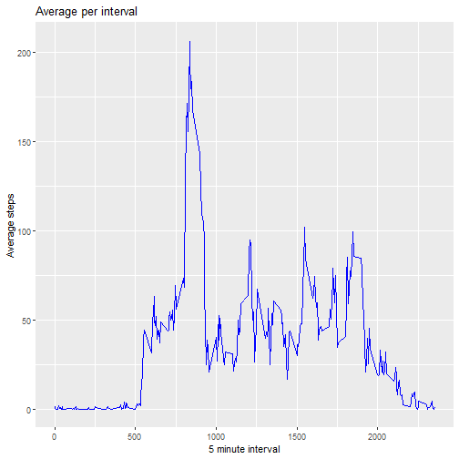

## Loading and preprocessing the data


```r
act_data <- read.csv("C:/Users/sumim/OneDrive/ドキュメント/Coursera datascience/Reproduciable Research/activity.csv")

str(act_data)
```

```
## 'data.frame':	17568 obs. of  3 variables:
##  $ steps   : int  NA NA NA NA NA NA NA NA NA NA ...
##  $ date    : chr  "2012-10-01" "2012-10-01" "2012-10-01" "2012-10-01" ...
##  $ interval: int  0 5 10 15 20 25 30 35 40 45 ...
```


```r
library(dplyr)
```

```
## 
##  次のパッケージを付け加えます: 'dplyr'
```

```
##  以下のオブジェクトは 'package:stats' からマスクされています:
## 
##     filter, lag
```

```
##  以下のオブジェクトは 'package:base' からマスクされています:
## 
##     intersect, setdiff, setequal, union
```

```r
library(ggplot2)
```

## What is mean total number of steps taken per day?


```r
tsteps_perday <- act_data %>%
  na.omit() %>%
  group_by(date) %>%
  summarize(total_steps = sum(steps))

head(tsteps_perday)
```

```
## # A tibble: 6 × 2
##   date       total_steps
##   <chr>            <int>
## 1 2012-10-02         126
## 2 2012-10-03       11352
## 3 2012-10-04       12116
## 4 2012-10-05       13294
## 5 2012-10-06       15420
## 6 2012-10-07       11015
```


```r
ggplot(tsteps_perday, aes(x= total_steps)) +
  geom_histogram(binwidth = 1000, fill="blue", color="black") +
  labs(title = "histgram of Total Steps per Day", x = "Total steps", y = "Count") +
 theme_minimal()
```


```r
mean_steps <- mean(tsteps_perday$total_steps)
median_steps <- median(tsteps_perday$total_steps)

mean_steps
```

```
## [1] 10766.19
```

```r
median_steps
```

```
## [1] 10765
```

## What is the average daily activity pattern?


```r
avsteps_perint <- act_data %>%
  na.omit() %>%
  group_by(interval) %>%
  summarize(av_steps = mean(steps))

str(avsteps_perint)
```

```
## tibble [288 × 2] (S3: tbl_df/tbl/data.frame)
##  $ interval: int [1:288] 0 5 10 15 20 25 30 35 40 45 ...
##  $ av_steps: num [1:288] 1.717 0.3396 0.1321 0.1509 0.0755 ...
```


```r
ggplot(avsteps_perint, aes(x = interval, y = av_steps)) +
  geom_line(color = "blue") +
  labs(title = "Average per interval", x = "5 minute interval", y = "Average steps")
```




```r
maxsteps_int <- avsteps_perint$interval[which.max(avsteps_perint$av_steps)]
maxsteps_int
```

```
## [1] 835
```

## Imputing missing values


```r
sum(is.na(act_data$steps))
```

```
## [1] 2304
```


```r
act_data_naimputed <- act_data %>%
left_join(avsteps_perint, by = "interval") %>%
  mutate(steps = ifelse(is.na(steps), av_steps, steps)) %>%
  select(-av_steps)

str(act_data_naimputed)
```

```
## 'data.frame':	17568 obs. of  3 variables:
##  $ steps   : num  1.717 0.3396 0.1321 0.1509 0.0755 ...
##  $ date    : chr  "2012-10-01" "2012-10-01" "2012-10-01" "2012-10-01" ...
##  $ interval: int  0 5 10 15 20 25 30 35 40 45 ...
```


```r
tsteps_perday2 <- act_data_naimputed %>%
  na.omit() %>%
  group_by(interval) %>%
  summarize(total_steps2 = sum(steps))

head(tsteps_perday2)
```

```
## # A tibble: 6 × 2
##   interval total_steps2
##      <int>        <dbl>
## 1        0       105.  
## 2        5        20.7 
## 3       10         8.06
## 4       15         9.21
## 5       20         4.60
## 6       25       128.
```


```r
ggplot(tsteps_perday2, aes(x= total_steps2)) +
  geom_histogram(binwidth = 1000, fill="blue", color="black") +
  labs(title = "histgram of Total Steps per Day", x = "Total steps new", y = "Count") +
 theme_minimal()
```


```r
mean_steps2 <- mean(tsteps_perday2$total_steps2)
median_steps2 <- median(tsteps_perday2$total_steps2)

mean_steps2
```

```
## [1] 2280.339
```

```r
median_steps2
```

```
## [1] 2080.906
```

## Are there differences in activity patterns between weekdays and weekends?


```r
act_data_naimputed$date <- as.Date(act_data_naimputed$date)
act_data_naimputed$date <- ifelse(weekdays(act_data_naimputed$date) %in% c("Saturday", "Sunday"), "Weekend", "Weekday")

str(act_data_naimputed)
```

```
## 'data.frame':	17568 obs. of  3 variables:
##  $ steps   : num  1.717 0.3396 0.1321 0.1509 0.0755 ...
##  $ date    : chr  "Weekday" "Weekday" "Weekday" "Weekday" ...
##  $ interval: int  0 5 10 15 20 25 30 35 40 45 ...
```


```r
avsteps_perint_week <- act_data_naimputed %>%
  group_by(interval, date) %>%
  summarize(av_steps_week = mean(steps))
```

```
## `summarise()` has grouped output by 'interval'. You can override using the `.groups`
## argument.
```

```r
head(avsteps_perint_week)
```

```
## # A tibble: 6 × 3
## # Groups:   interval [3]
##   interval date    av_steps_week
##      <int> <chr>           <dbl>
## 1        0 Weekday        2.25  
## 2        0 Weekend        0.215 
## 3        5 Weekday        0.445 
## 4        5 Weekend        0.0425
## 5       10 Weekday        0.173 
## 6       10 Weekend        0.0165
```


```r
ggplot(avsteps_perint_week, aes(x = interval, y = av_steps_week, color = date)) +
  geom_line() +
  labs(title = "Average per interval weekday vs weekend", x = "5 minute interval", y = "Average steps") +
  scale_color_manual(values = c("Weekday" = "blue", "Weekend" = "red"))
```


